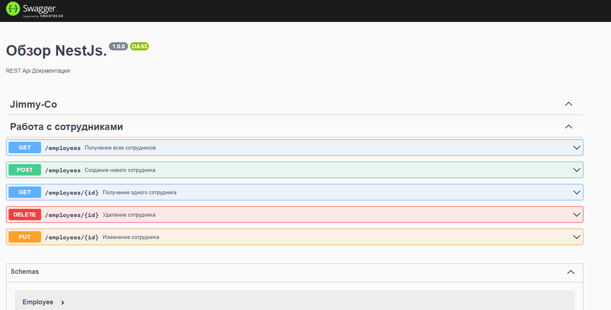

Личный обзор (REST API) на NestJS + MongoDb(mongoose)

(обзор пока на локальном сервере)

Ключевые:
// в приттиер добавить "endOfLine": "auto" тк может из-за кареток выдавать ошибки.

1. Exception filters / HttpCode + httpStatus (обработка статусов, ошибок месседжей и тд)
2. Возможность создавать отдельные модули, супер удобно.
3. Типизация фулл.
4. Module => controller => service for controller => dto "data transfer object" (как описание типа) + Schemas

Создано:

1. REST Api полный цикл по Сотрудникам
2. Добавлены (module / cotrollers / services / dto / schema)
3. Добавлена валидация всех полей с выведением ошибок в ответе.
4. Сделана документация с использованием Swagger.

Дальнейшие действия это рассмотрение более сложной схемы. Сделать авторизацию на NestJs + mongoose. (jwt /bcrypt и тд) Для обучения работы с Next параметром из (Express) в Nestjs. Связываение схем по айди через нест.

По валидации Важные параметры для Pipe:

1. "transform": опция указывает, следует ли преобразовывать (трансформировать) значения запроса в соответствующие типы данных, определенные в DTO. Например, если поле age определено как number, а клиент отправляет его в виде строки, то с помощью этой опции можно автоматически преобразовать его в число. По умолчанию опция transform равна false.

2. "whitelist" : опция указывает, должны ли быть разрешены только те поля, которые определены в DTO. Если опция whitelist установлена в true, то любые неопределенные поля будут отброшены. Если она установлена в false (по умолчанию), то любые поля, которые не являются частью DTO, будут сохранены в запросе.

3. "forbidUnknownValues" : опция указывает, следует ли генерировать ошибку, если в теле запроса содержатся неопределенные поля. Если эта опция установлена в true, то любые неопределенные поля в теле запроса будут приводить к ошибке. По умолчанию эта опция установлена в false.

Swagger документация готовый пример:

